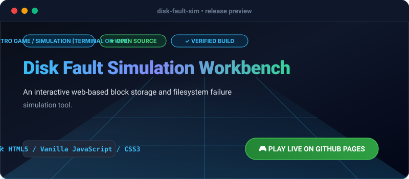

# Disk Fault Simulation Workbench

[](https://olamideakinade.github.io/disk-fault-sim/)
[](https://github.com/Olamideakinade/disk-fault-sim)
[](https://opensource.org/licenses/MIT)



> 🚀 **Live Demo Available:** Test and play this project live right now: **[https://olamideakinade.github.io/disk-fault-sim/](https://olamideakinade.github.io/disk-fault-sim/)**

## Overview

Disk Fault Simulation Workbench is an interactive HTML5/JavaScript retro-style terminal simulation that models low-level block allocation, disk fragmentation, bad sector corruption, data recovery, and file pinning operations.

## Features (v1.1.0)

- **Visual Block Matrix**: Real-time canvas rendering of 1,024 disk blocks (32x32) with distinct color coding for Free, Allocated, Corrupted, and Pinned states.
- **Fault Injection & Recovery**: Simulate sector degradation, sector healing, file allocation, and defragmentation.
- **Diagnostics & Snapshots**: Export full disk states to JSON or restore saved configurations instantly.
- **Keyboard Shortcuts**: Fast testing shortcuts (Space: Self-Test, C: Inject Fault, R: Defrag, Shift+R: Reset).

## Getting Started

Clone the repository and serve via any static web server:

```bash
git clone https://github.com/Olamideakinade/disk-fault-sim.git
cd disk-fault-sim
python3 -m http.server 8080
```

## License

MIT License. See [LICENSE](LICENSE) for details.
